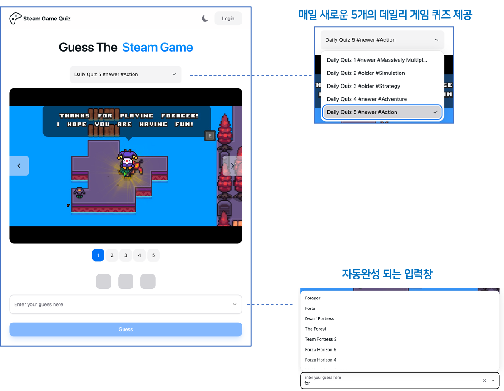
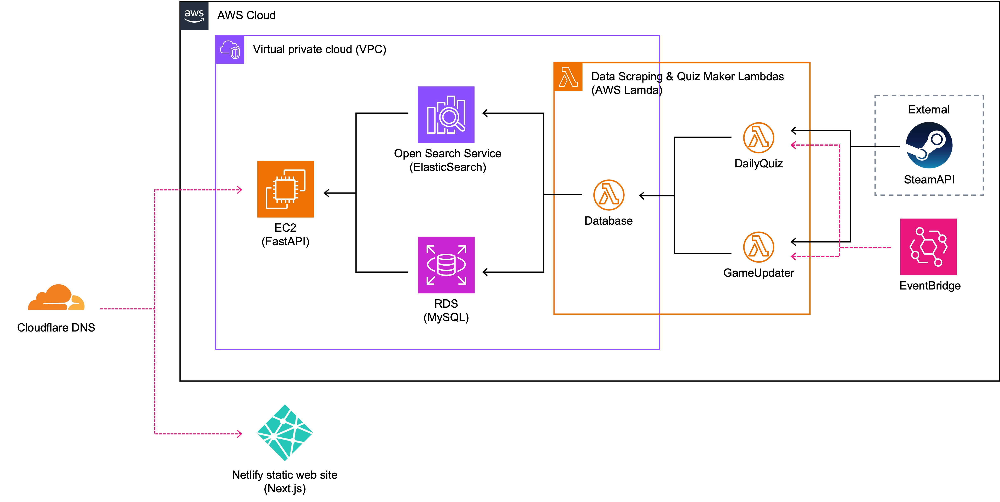

  
  
  <h2>Guess The Steam Game</h2>

  <h3><a href="https://app.steamgamequiz.com">🎮app.steamgamequiz.com🎮</a></h3>

  

    
    
    
     
    
    
    
    
    
    
    
    
    
     
  

 

## 프로젝트 설명

<strong>Steam Game Quiz</strong>는 스팀 게임에 관련된 퀴즈를 제공하는 서비스입니다. 🎮

## 시연 영상

## 프로젝트 아키텍쳐

### 인프라 아키텍처

## Further Reading

- [시연 영상 ](https://youtu.be/WlqPoyApUhE)
- [웹 사이트 ](https://app.steamgamequiz.com)
- [개발자의 개발 일기 ](https://2jun0.tistory.com/category/%ED%94%84%EB%A1%9C%EA%B7%B8%EB%9E%98%EB%B0%8D/%EC%8A%A4%ED%8C%80%20%EA%B2%8C%EC%9E%84%20%ED%80%B4%EC%A6%88)
