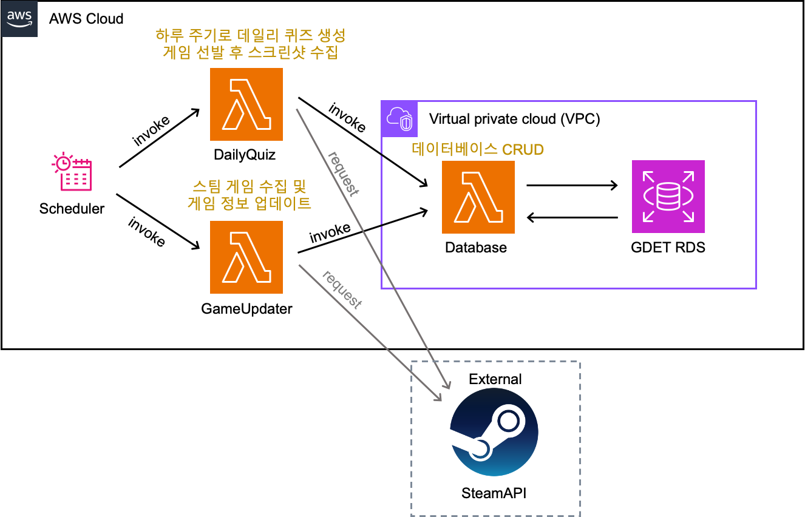

# AWS Lambdas

본 서비스의 배치 작업을 위한 serverless 애플리케이션입니다  
아래 세개의 에플리케이션으로 구성되어 있습니다. 
- **daily_quiz**, **database_lambda**, **game_updater**

## 설정 🛠️

1. AWS에서 Lambda 함수를 생성합니다.  
    - 런타임 설정
        - 런타임: python 3.9
        - 아키텍쳐: x84_64
        - 핸들러: `[daily_quiz/database_lambda/game_updater].lambda_func.lambda_handler`
2. `scripts/build_***_lambda`파일을 현재 폴더에서 실행합니다.
3. Lambda 코드에 생성된 `build/***_lambda.zip`파일을 업로드 합니다.
4. Lambda 구성을 아래와 같이 수정합니다.
    - 제한시간: 15분
    - 메모리: 512MB (game_updater 한정)
    - 권한: `lambda:InvokeFunction` 추가 (daily_quiz/game_updater 한정)
    - VPC: rds와 같은 vpc 서브넷 (database_lambda 한정)

## 인프라 아키텍쳐

